# Model-Task Pipeline Pitch

Status: active
Owner area: proposal and team pitch
Last verified: 2026-06-14

## PNG Chart

[model_task_pipeline_pitch.png](assets/model_task_pipeline_pitch.png)

## One Flow

```mermaid

%%{init: {"theme": "base", "themeVariables": {"fontFamily": "Inter, Arial, sans-serif", "primaryTextColor": "#172033", "lineColor": "#536173", "primaryBorderColor": "#52627A", "primaryColor": "#EEF4FF", "secondaryColor": "#F4F7F2", "tertiaryColor": "#FFF6E5"}}}%%
flowchart LR
    A["Raw Dataset Row<br/>text + label + ID + metadata"]:::input
    B["Privacy + Author Doxxing Risk<br/>PII spans, handles, locations, author clues"]:::task
    C["Risk Hiding<br/>typed placeholders + style reduction"]:::task
    D["Meaning Protection<br/>target, threat, negation, quote, counterspeech"]:::task
    E["Optional HSD Advisory<br/>drift check or local enriched predictions"]:::task
    F["Output + Manifest<br/>exact protected text, validation, provider/model status"]:::output

    A --> B --> C --> D --> E --> F
    D -- "meaning changed too much" --> C

    classDef input fill:#E8F1FF,stroke:#3768A6,stroke-width:2px,color:#172033;
    classDef task fill:#F4F7F2,stroke:#52627A,stroke-width:2px,color:#172033;
    classDef output fill:#EAF7EF,stroke:#2F7D54,stroke-width:3px,color:#172033;
```



## Pitch

ContextSafe-HSD is a modular privacy layer for hate-speech datasets. It does not
try to be a legal decision system or one giant black-box rewrite model. It takes
a raw row, detects privacy and author-doxxing risks, hides risky details,
checks that hate-speech meaning survived, optionally scores protected text for
utility drift or local enriched analysis, and exports an auditable
reviewer-safe result.

The main design choice is: **use pretrained models per task, but keep each model
output narrow and checkable.**

## Pipeline Tasks

| Task | What it does | Model / technology |
| --- | --- | --- |
| Privacy risk detection | Finds names, emails, handles, locations, organizations, IDs, phone numbers. | Deterministic regex/rule detector is always present; optional local Presidio, scrubadub, GLiNER, and token-policy spans can add candidates in auto mode |
| Author doxxing risk identification | Detects details that can expose or re-identify the author or target: repeated handle, school/workplace, city, contact info, signature, unique style markers. | PII span combinations, metadata checks, style-risk heuristics, optional author-risk classifier |
| Risk hiding | Replaces accepted spans with placeholders and optionally reduces author-style leakage. | Deterministic policy: `[PERSON]`, `[USER]`, `[EMAIL]`, `[LOCATION]`, `[ORG]`, `[ID]`; style scrubber |
| Meaning protection | Checks whether masking removed target group, threat, negation, quote, counterspeech, or other HSD cues. | Rule-based cue checks plus HSD model drift check |
| HSD advisory / local classification | Scores original and protected text for candidate selection or appends local prediction columns in `sanitize-classify`. | Default approved advisory ensemble: `facebook/roberta-hate-speech-dynabench-r4-target` and `cardiffnlp/twitter-roberta-base-hate-latest`; local TF-IDF + Logistic Regression baseline commands are available |
| Optional rationale | Proposed/research evidence for explaining abusive/normal predictions. | `Hate-speech-CNERG/bert-base-uncased-hatexplain-rationale-two` is not part of the current official auto path |
| Audit | Records what changed without storing raw sensitive text. | Exact manifest, validation status, provider/model status, load counts, span/metric counts; optional row audit for local `anonymize`/`sanitize-classify` runs |

## Author Doxxing Risk

This should be explicit in the MVP. We are not only hiding obvious PII in the
content; we also care about whether the text can expose the author or another
person through combined clues.

Examples of author/doxxing risk:

- handle + school or workplace;
- name + city;
- email or phone number;
- repeated signature, catchphrase, hashtag, or writing style;
- metadata such as author ID, source, platform, or location;
- “go find X at Y school/workplace” style threats.

Output should be simple:

```text
Author/doxxing risk: low / medium / high
Reasons: USER + ORG + LOCATION detected
Action: mask direct identifiers and flag for reviewer-safe display
```

## Model Notes

These are approved or proposed components, not a claim that every model runs on
every official row. The current official auto path keeps deterministic balanced
masking as the always-available fallback and uses optional local components only
when dependencies/artifacts are ready.

- `nvidia/gliner-PII`: optional PII/PHI span detector for broad privacy-risk
  detection when GLiNER dependency and a local or download-allowed model are
  available.
- Microsoft Presidio: mature PII detection and anonymization framework; useful
  as a fallback/comparison detector and for custom recognizers/operators.
- scrubadub: lightweight PII detector for emails, URLs, phones, handles, names,
  and address-like spans.
- regex rules: deterministic safety net for obvious emails, URLs, phone
  numbers, handles, and IDs.
- `cardiffnlp/twitter-roberta-base-hate-latest`: binary hate-speech classifier
  fine-tuned on 13 English hate-speech datasets.
- `facebook/roberta-hate-speech-dynabench-r4-target`: hate-detection model
  useful as a robustness/advisory check.
- `Hate-speech-CNERG/bert-base-uncased-hatexplain-rationale-two`: optional
  proposed rationale/classification model for explaining abusive/normal
  predictions.

Source links:

- https://huggingface.co/nvidia/gliner-PII
- https://microsoft.github.io/presidio/
- https://huggingface.co/cardiffnlp/twitter-roberta-base-hate-latest
- https://huggingface.co/facebook/roberta-hate-speech-dynabench-r4-target
- https://huggingface.co/Hate-speech-CNERG/bert-base-uncased-hatexplain-rationale-two
