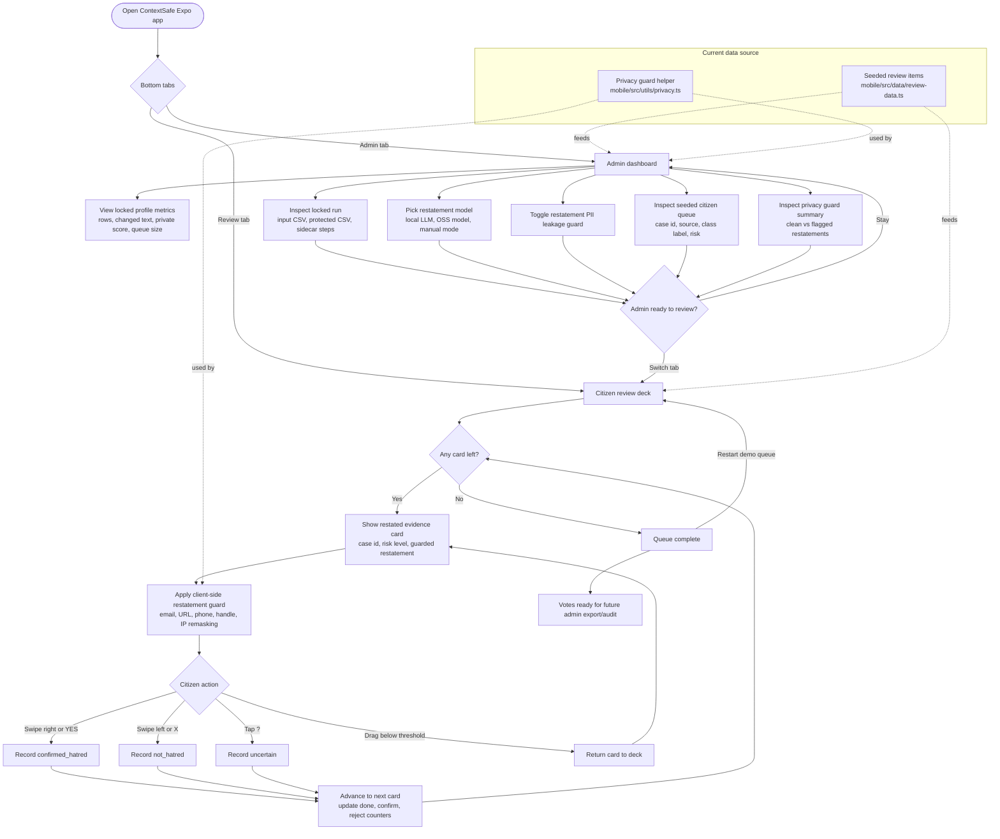

# Mobile App User Flow

Status: current implementation
Last verified: 2026-06-18

This diagram reflects the Expo app in `mobile/src/app`. The app currently has
two routes: the admin console at `/` and the citizen review deck at `/review`.
Review data is still seeded from `mobile/src/data/review-data.ts`; the local
backend API exists but is not yet wired into the mobile screens.

## Current Screen Responsibilities

- Admin dashboard: shows the locked baseline/profile state, allows model selection,
  toggles the guard, and previews the review queue/audit summary.
- Citizen review deck: shows guarded restatements only, collects
  `confirmed_hatred`, `not_hatred`, or `uncertain` decisions, and maintains
  local progress counters.
- Privacy guard: remasks direct identifiers in restatements before display and
  reports findings for admin audit.

## Not Wired Yet

- CSV upload from the app.
- Live fetch from `contextsafe_hsd.api_server`.
- Running restatement models from the admin UI.
- Persisting citizen votes to backend storage.
- Exporting reviewed labels back to CSV/audit files.
