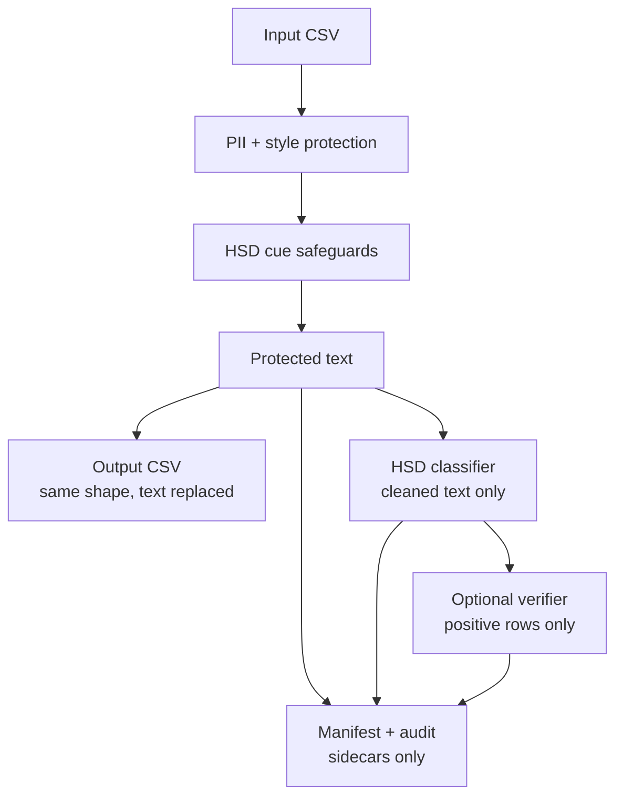
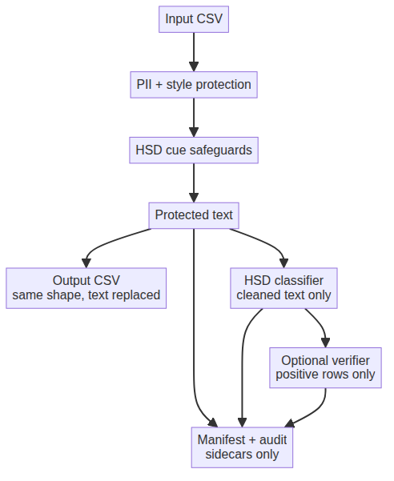
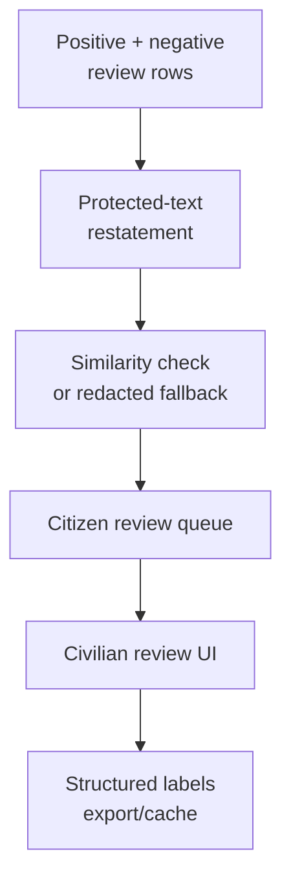
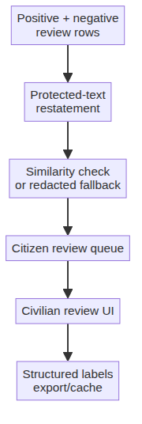

# System Diagrams

Status: active
Last verified: 2026-06-17

Two compact diagrams cover the core data flow and the civilian review platform.
For the current Expo screen-by-screen flow, see
[mobile_user_flow.md](mobile_user_flow.md).

## Core Pipeline

## Civilian Review Platform

## Boundaries

- Raw original text does not enter the civilian review UI.
- Citizen review can include both positive and negative HSD rows for broader
  validation data.
- The protected CSV keeps the original shape; helper data stays in sidecars.
- Classifier, verifier, civilian evidence, and reviewer votes are separate
  artifacts.
